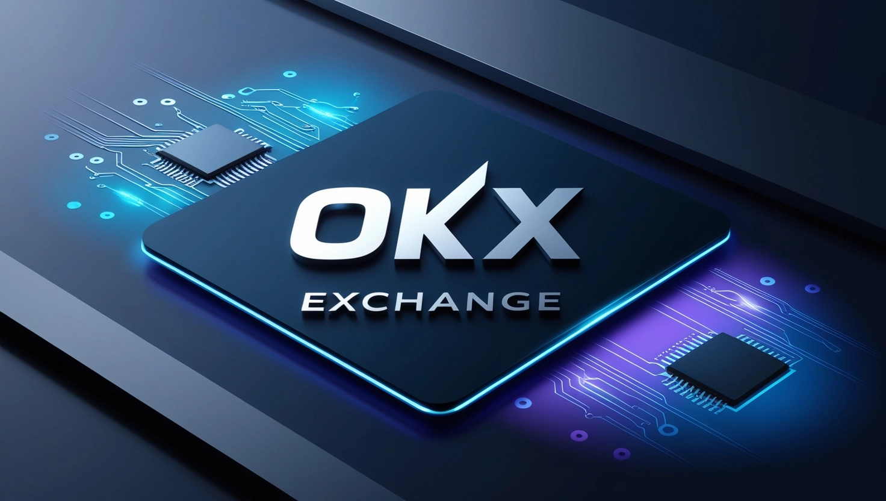
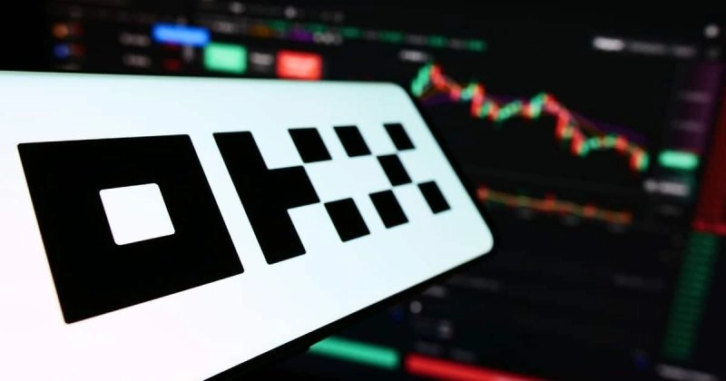
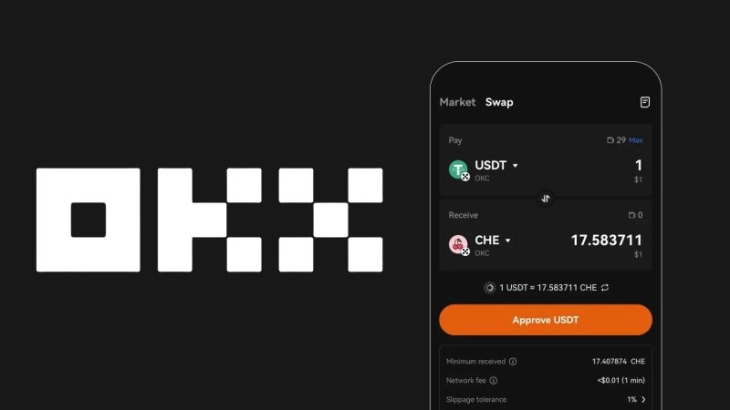
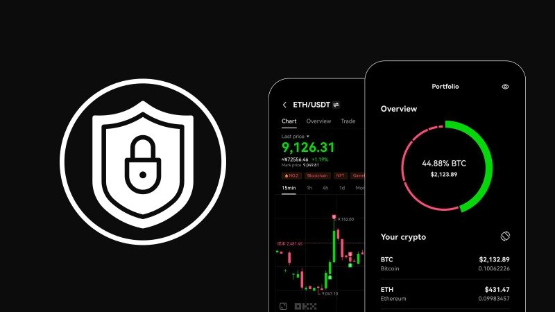
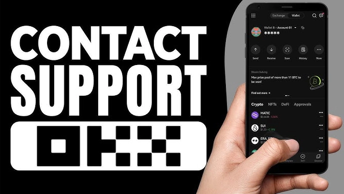
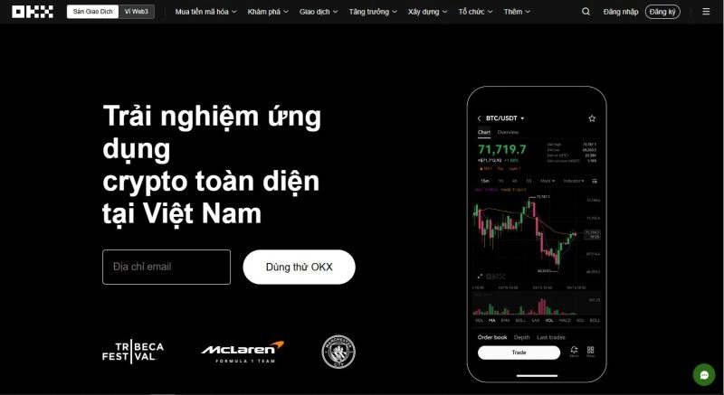
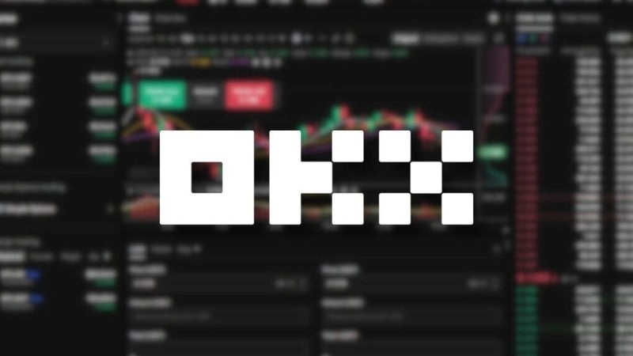

# OKX交易所深度测评：靠谱还是噱头？

加密货币交易所那么多，OKX到底值不值得信任？这不是一个简单的"是"或"否"的问题。本文会从实际使用角度出发，聊聊OKX的真实表现——包括那些让人满意的地方，也包括一些可能让你皱眉的细节。如果你正在考虑选择一个交易平台，或者想知道OKX是否适合你的交易风格，这篇文章会给你一些参考。

---

## OKX的来路：2017年至今的演变

OKX成立于2017年，总部设在塞舌尔。这个时间点很有意思——正好赶上加密货币市场的第一波大爆发。背靠OK Group这棵大树，OKX从一开始就不是小打小闹，而是瞄准了全球市场。

几年下来，OKX已经在亚洲、欧洲甚至全球多个地区站稳了脚跟。用户规模、交易量都在稳步增长。当然，规模大不等于好用，后面我们会详细说说。

OKX的目标很明确：打造一个全方位的数字金融平台。听起来有点宏大，但实际上就是想让用户在一个地方完成各种加密货币相关的操作——不管是简单的买卖，还是复杂的衍生品交易。这种"大而全"的策略有好有坏，稍后会展开。

## 功能丰富到让人眼花：OKX能干什么？

### 现货和期货：基础中的基础

OKX支持现货交易，这个没什么好说的——买币、卖币，实时成交，价格透明。流动性不错，常见的交易对基本都有。

期货方面，OKX提供了多种合约类型：周合约、月合约、季度合约。还有永续合约——这种没有到期日的合约对长期持仓的人来说挺方便。不过，期货玩得不好容易亏得很惨，新手要慎重。

### 杠杆交易：放大收益也放大风险

OKX的杠杆交易最高可以达到100倍。听起来很刺激对吧？但这把双刃剑不是谁都能玩转的。杠杆交易意味着你可以用更少的本金撬动更大的仓位，但市场稍有波动，你的账户可能就爆仓了。

支持的交易对很多，从BTC/USDT、ETH/USDT这些主流币种，到一些小众的代币都有。如果你知道自己在做什么，杠杆交易确实能提高资金利用率。如果不知道，建议先别碰。

### 期权和永续互换：进阶玩家的工具

**期权**：这是一种赋予你权利（但不是义务）在未来某个时间点以特定价格买卖资产的合约。OKX支持看涨期权和看跌期权，适合用来对冲风险或进行复杂的交易策略。不过说实话，期权不是一般人能轻易上手的。

**永续互换**：和期货类似，但没有到期日。你可以一直持有仓位，不用担心合约到期的问题。OKX的永续合约流动性不错，适合那些想长期持仓但又需要灵活性的人。

### 质押和储蓄：让币生币

如果你不想频繁交易，OKX也提供了质押（Staking）和储蓄服务。👉 [想让你的加密资产稳定增值？看看OKX的质押和储蓄选项](https://www.okx.com/join/62834398)

质押就是把某些币种锁定一段时间，然后获得利息。支持的币种包括ETH、DOT等。储蓄产品分为灵活和定期两种，利率根据市场情况浮动。这种方式适合长期投资者，但要注意锁定期和利率变化。

### DeFi和NFT：追赶潮流

OKX也在DeFi和NFT领域有布局。DeFi方面，平台连接了多个去中心化金融项目，用户可以参与借贷、流动性挖矿等。NFT市场则允许用户买卖数字艺术品、游戏道具等。

这些功能算是锦上添花，但坦白说，如果你只是想简单地交易加密货币，可能用不上这些。

## 费用：便宜还是贵？

费用是选择交易所时最关心的问题之一。OKX的费率结构是Maker-Taker模式。

### 现货交易费

- **Maker**（挂单）：你在订单簿上放一个限价单，为市场提供流动性。Maker费率通常较低。
- **Taker**（吃单）：你直接以市场价成交，从订单簿中拿走流动性。Taker费率稍高。

具体费率取决于你的账户等级，交易量越大，费率越低。如果你持有OKB（OKX的平台币），还能享受额外折扣。

### 期货和杠杆交易费

期货和杠杆交易的费率结构类似，但总体比现货略低。高级别用户的Maker费率甚至可以接近零。

### 提币费

提币费根据币种和网络状况浮动。有时候比较高，尤其是在网络拥堵的时候。这是一个需要注意的点——如果你经常提币到外部钱包，费用可能会累积起来。

### 优惠政策

OKX有VIP等级制度，等级越高，费率越优惠。此外，持有OKB可以进一步降低手续费。对于大额交易者来说，这些优惠还是挺实际的。

## 界面和体验：好用吗？

### 网页端和移动端

OKX的界面设计算是简洁清爽的那种。网页端和手机App都有，功能基本一致。操作起来不算复杂，但也不能说特别直观——新手可能需要一点时间适应。

速度方面表现不错，订单执行比较快，页面切换也挺流畅。不过偶尔会遇到卡顿，特别是在市场剧烈波动的时候。

### 图表和分析工具

OKX集成了TradingView，这是一个专业的图表工具。支持各种技术指标，比如MACD、RSI、布林带等。对于喜欢技术分析的人来说，这些工具足够用了。

但如果你是新手，可能会觉得功能太多反而有点迷惑。不过好在OKX提供了一些教程，可以帮你快速上手。

### 多语言支持

OKX支持20多种语言，包括越南语、中文、英语、日语等。这对非英语用户来说是个加分项。不过有时候翻译会有点生硬，偶尔需要对照英文版才能理解清楚。

### 用户反馈

从社区反馈来看，大部分用户对OKX的稳定性和安全性比较满意。但也有人抱怨客服响应速度不够快，或者某些功能不够直观。总体来说，体验还算中等偏上。

## 安全性：你的币安全吗？

### 账户安全

OKX提供了多层账户保护措施：

- **双因素认证（2FA）**：通过Google Authenticator或短信验证码增加一层保护。
- **邮件/短信验证码**：每次提币或修改敏感设置时都需要额外验证。
- **API密钥管理**：如果你使用API交易，OKX允许你设置权限，限制API的操作范围。

这些措施基本上能防住大部分常见的攻击手段，但前提是你自己也要注意账户安全——比如不要在公共Wi-Fi下登录，定期更换密码等。

### 冷钱包存储

OKX声称大约95%的用户资产存储在冷钱包中。冷钱包是离线存储，理论上不会被黑客攻击。只有少量资产保存在热钱包中用于日常交易。

### 保险基金

OKX为期货和杠杆交易设立了保险基金，用于在极端市场波动时保护用户免受爆仓损失。这算是一个额外的保障措施。

### 历史记录

到目前为止，OKX没有发生过重大的安全事故。这是一个好消息，但也不意味着未来就一定安全。加密货币行业本身就充满风险，任何平台都可能面临未知的威胁。

## 客服：能指望他们吗？

### 支持渠道

OKX提供了多种客服渠道：

- **在线聊天**：网页端和App都有，24/7服务。
- **邮件**：适合处理复杂问题或需要详细解释的情况。
- **社交媒体**：Twitter、Facebook、Telegram上都有官方账号。

### 响应速度

在线聊天通常能在几分钟内得到回复，速度还算快。但问题的解决质量就参差不齐了——有时候客服能快速帮你解决问题，有时候只是给你发一些标准化的回答，并没有实际帮助。

邮件响应相对慢一些，可能需要几个小时到一天的时间。

### 帮助中心

OKX有一个相当详细的帮助中心，包括常见问题解答（FAQ）、教程和指南。如果你遇到的问题比较常见，通常可以在这里找到答案。对于新手来说，这些资源还是挺有用的。

## 社区评价：别人怎么说？

### 用户反馈

在Trustpilot、Reddit等平台上，OKX的评价比较两极分化。有人觉得功能强大、费用合理；也有人抱怨客服不给力、某些功能难用。

总体来说，积极评价还是占多数的，但负面反馈也不能忽视。

### 行业地位

OKX在全球交易所排名中通常位于前十，和Binance、Huobi等平台处于同一梯队。这说明它在行业内还是有一定分量的。

### 法律问题

OKX在某些国家面临监管压力，部分功能可能在特定地区受限。不过到目前为止，没有发生过重大的法律纠纷或用户资产损失事件。

## 优点和缺点：说点实话

### 优点

- **功能多样**：从现货到衍生品，从质押到NFT，基本你能想到的都有。
- **费率合理**：尤其是对VIP用户和OKB持有者来说，费用优势明显。
- **安全性不错**：多层保护措施、冷钱包存储、保险基金等都有。
- **社区活跃**：用户基数大，容易找到交流和学习的资源。

### 缺点

- **对新手不够友好**：功能太多反而让人不知道从哪开始。衍生品交易对新手来说门槛较高。
- **地区限制**：某些国家和地区的用户无法使用部分功能。
- **提币费有时偏高**：尤其是在网络拥堵时，提币成本可能让人肉疼。
- **客服质量不稳定**：有时候很快解决问题，有时候只是敷衍了事。

## 结论：OKX适合你吗？

OKX是一个功能全面、安全性较高的加密货币交易所。它适合那些想要一站式解决各种交易需求的人——不管是简单的买卖，还是复杂的衍生品操作。

但如果你是新手，可能需要花点时间学习和适应。建议从现货交易开始，熟悉平台后再尝试其他功能。另外，注意提币费用和地区限制问题。

👉 [准备开始加密货币投资？OKX提供从现货到衍生品的全方位服务](https://www.okx.com/join/62834398)

对于有经验的交易者来说，OKX的VIP计划和丰富的工具确实能提升交易体验。但任何平台都有不足之处，关键是找到适合自己需求的那一个。

说到底，选择交易所就像选鞋——合不合脚只有自己知道。OKX提供了很多选项，但能不能用好，还得看你自己。
